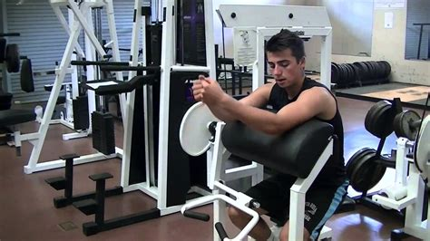
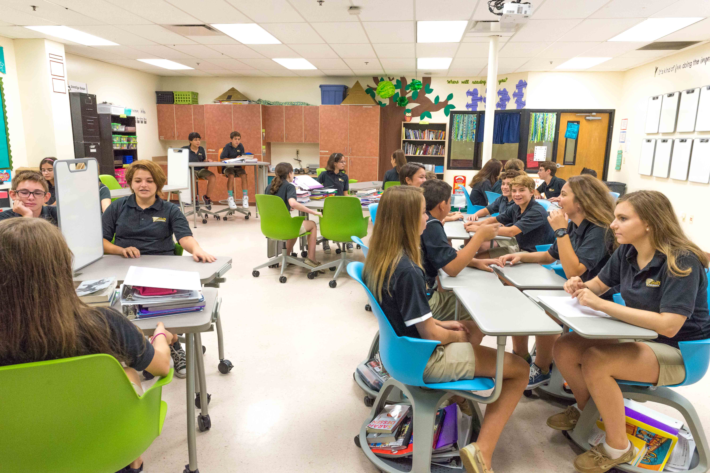
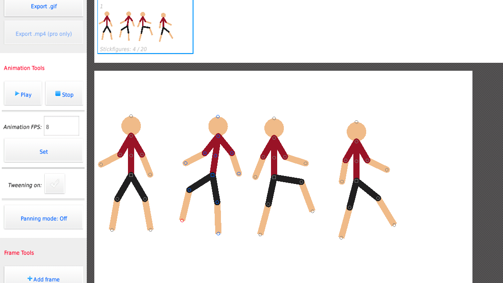

<html>

<head>
	<link rel="stylesheet" href="css/style1.css">
</head>

<body>
	

		

			<h2>Hi!</h2>
			
 My name's Ken. I like to watch anime, work out, animate, and play videogames! Pretty standard life.

			
		

		

		

			<h2>What I Do Weekly:</h2>
			

				<h3>Gym</h3>
				
I go to the gym 2 times a week. My training consists of different focuses per lesson such as training my biceps, cores, tricpes, and so on.

				
			

			

				<h3>School</h3>
				
Like most people, I go to school. Nothing really special about that, but I did learn how to make this website there

				
			

		

	

		

			<h3>Video Games</h3>
			
I enjoy videogames from time to time, usually the casual stuff like Minecraft, roblox. Sonic Mania or Black Ops III

			
		

		

			<h3>Animation</h3>
			
I like to do animations as a hobby, not the kinds where you need to draw each frame but the ones that includes 2d rigs, or nodes, that I joint together.

			
		

		

	

		

			<h2>Get In Touch!</h2>
			<h3>Contacts</h3>
			
If you wanna get in touch, you can hit me up:

			<a href="contact.html">Here</a>			
		

	

</body>

</html>
